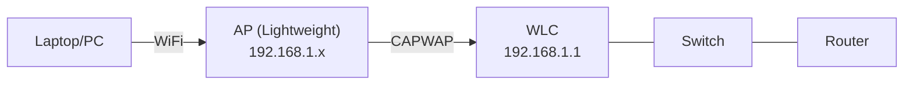

## Overview

Configure a wireless network through Cisco WLC (Wireless LAN Controller): create a WLAN, configure a WPA2 security profile, and manage APs.

## Topology

## Tasks

### Connect to the WLC
1. Open a browser → `https://192.168.1.1` (WLC Management IP)
2. Log in (admin/admin or cisco/cisco)
3. Familiarize yourself with the WLC interface

### Create a WLAN
4. Monitor → Access Points — confirm the AP is registered
5. WLANs → Create New:
   - **Profile Name**: CCNA-WLAN
   - **SSID**: CCNA
   - **Interface**: management
6. Security → Layer 2:
   - **Security**: WPA+WPA2
   - **Auth Key Mgmt**: PSK
   - **PSK**: Cisco123!
7. Enable the WLAN → Apply
8. Connect the Laptop to SSID "CCNA" with the password

### View Statistics
9. Monitor → Clients — view connected clients
10. Monitor → Statistics — traffic on the AP

### VLAN for Wireless
11. Create an additional WLC interface for a VLAN (Guest):
    - Controller → Interfaces → New
    - VLAN ID: 20, IP: 10.10.20.1/24
12. Create a separate SSID for guests: "Guest-WLAN" → Interface: VLAN20

## Key Concepts

| Concept | Description |
|---|---|
| Lightweight AP | Managed by the WLC; configuration delivered via CAPWAP |
| CAPWAP | UDP 5246 (control), 5247 (data) — tunnel between AP and WLC |
| WPA2-Personal | PSK (Pre-Shared Key) |
| WPA2-Enterprise | 802.1X + RADIUS |
| SSID | Wireless network name (visible to clients) |
| BSSID | AP MAC address (unique per radio) |

> **💡 Tip:**
> Packet Tracer's WLC supports limited functionality. For full testing, use real hardware or GNS3 with WLC images. The CCNA exam requires knowledge of the WLC GUI — creating WLANs and configuring security.
