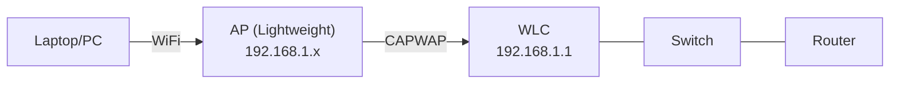

## Описание

Настройка беспроводной сети через Cisco WLC (Wireless LAN Controller): создание WLAN, профиля безопасности WPA2, управление AP.

## Топология

## Задачи

### Подключение к WLC
1. Открыть браузер → `https://192.168.1.1` (WLC Management IP)
2. Войти (admin/admin или cisco/cisco)
3. Ознакомиться с интерфейсом WLC

### Создание WLAN
4. Monitor → Access Points — убедиться, что AP зарегистрирована
5. WLANs → Create New:
   - **Profile Name**: CCNA-WLAN
   - **SSID**: CCNA
   - **Interface**: management
6. Security → Layer 2:
   - **Security**: WPA+WPA2
   - **Auth Key Mgmt**: PSK
   - **PSK**: Cisco123!
7. Enable WLAN → Apply
8. Подключить Laptop к SSID "CCNA" с паролем

### Просмотр статистики
9. Monitor → Clients — просмотреть подключённых клиентов
10. Monitor → Statistics — трафик на AP

### VLAN для Wireless
11. Создать дополнительный интерфейс WLC для VLAN (Guest):
    - Controller → Interfaces → New
    - VLAN ID: 20, IP: 10.10.20.1/24
12. Создать отдельный SSID для гостей: "Guest-WLAN" → Interface: VLAN20

## Ключевые концепции

| Концепция | Описание |
|---|---|
| Lightweight AP | Управляется WLC, конфигурация через CAPWAP |
| CAPWAP | UDP 5246 (control), 5247 (data) — туннель AP↔WLC |
| WPA2-Personal | PSK (Pre-Shared Key) |
| WPA2-Enterprise | 802.1X + RADIUS |
| SSID | Имя беспроводной сети (видит клиент) |
| BSSID | MAC-адрес AP (уникален для каждого radio) |

> **💡 Совет:**
> В Packet Tracer WLC поддерживает ограниченный функционал. Для полного тестирования используй реальное оборудование или GNS3 с образами WLC. В экзамене CCNA требуется знать GUI WLC — создание WLAN, настройка безопасности.
