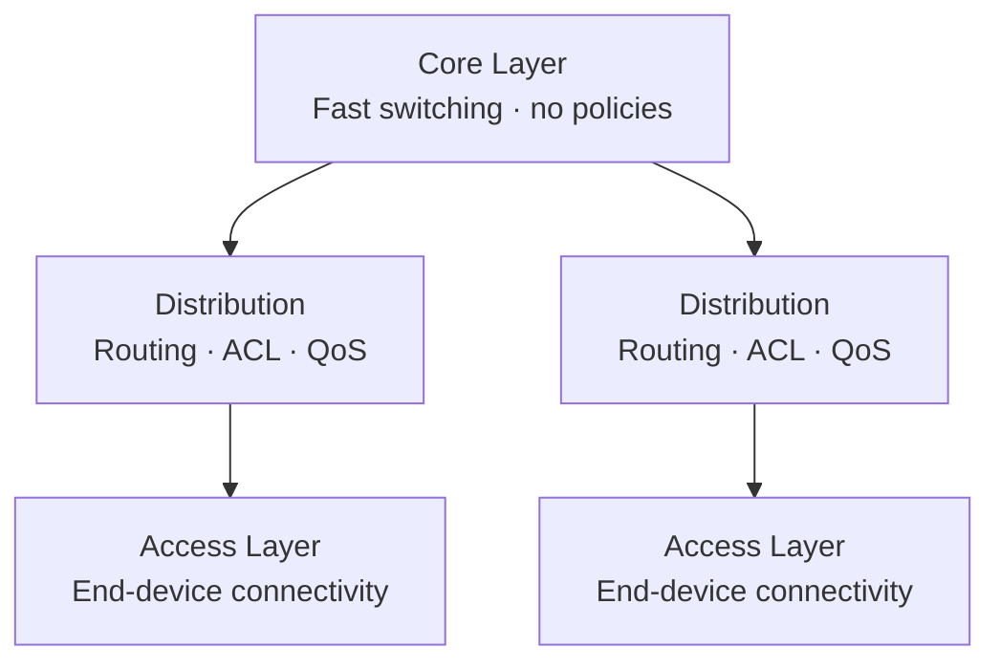

## Network Types by Scale

| Type | Name | Coverage |
|---|---|---|
| PAN | Personal Area Network | A few meters (Bluetooth) |
| LAN | Local Area Network | Building, office |
| MAN | Metropolitan Area Network | City |
| WAN | Wide Area Network | Country, world |
| WLAN | Wireless LAN | Wireless local area |
| SAN | Storage Area Network | Storage network |

---

## Physical Topologies

| Topology | Description | Pros | Cons |
|---|---|---|---|
| Bus | All nodes on a single cable | Inexpensive | One break takes down the entire network |
| Star | All nodes connect to a central switch | Reliability, scalability | Single point of failure at the center |
| Ring | Nodes connected in a ring | Predictable | Complex failure scenarios |
| Mesh | Each node connects to multiple others | High fault tolerance | Expensive |
| Hybrid | Combination of topologies | Flexibility | Complexity |

> **💡 Tip:** Modern enterprise networks are built on a **star** topology (physically) — all devices connect to access layer switches.

---

## Logical Topologies

A logical topology describes how data actually flows in a network, regardless of the physical wiring.

- **Ethernet** — logical bus (CSMA/CD in older versions); now operates point-to-point through switches
- **Wi-Fi (802.11)** — logical bus (CSMA/CA)
- **Token Ring** — logical ring (obsolete)

---

## Network Characteristics

| Characteristic | Description |
|---|---|
| Bandwidth | Maximum amount of data per unit of time |
| Throughput | Actual data successfully transferred |
| Latency | Time from send to receive |
| Jitter | Variation in latency (critical for VoIP) |
| Packet loss | Percentage of packets that do not reach their destination |

---

## Cisco Three-Tier Hierarchical Model

| Layer | Functions |
|---|---|
| Core | High-speed switching, minimal latency, no policies |
| Distribution | Routing, ACL, route summarization, QoS |
| Access | End-device connectivity, PoE, Port Security, VLANs |

---

## Broadcast and Collision Domains

| Concept | Defined by | Separated by |
|---|---|---|
| Collision domain | Shared medium segment | Switch (one per port) |
| Broadcast domain | Set of devices that receive broadcasts | Router or VLAN |

> **📌 Important:** A switch separates collision domains (one per port) but does **not** separate the broadcast domain. A router separates both types of domains.

---

## Resources

| Resource | Description |
|---|---|
| [Network Topologies — networklessons.com](https://networklessons.com/cisco/ccna-routing-switching-icnd1-100-105/network-topologies) | Overview of physical and logical network topologies |
| [Three-Tier Network Architecture — Cisco](https://www.cisco.com/c/en/us/td/docs/solutions/Enterprise/Campus/campover.html) | Cisco Campus Network Design: Access, Distribution, Core |
| [Jeremy's IT Lab — Network Topology Architectures (YouTube)](https://www.youtube.com/watch?v=Wm2rOA2Vrv0) | Topologies and three-tier model lesson from the Free CCNA series |
| [Collision vs Broadcast Domain — networklessons.com](https://networklessons.com/cisco/ccna-routing-switching-icnd1-100-105/collision-broadcast-domain) | Difference between collision and broadcast domains |
| [Spine-Leaf Architecture — Cisco](https://www.cisco.com/c/en/us/solutions/data-center-virtualization/what-is-a-spine-and-leaf-architecture.html) | Cisco explanation of Spine-Leaf topology for data centers |
