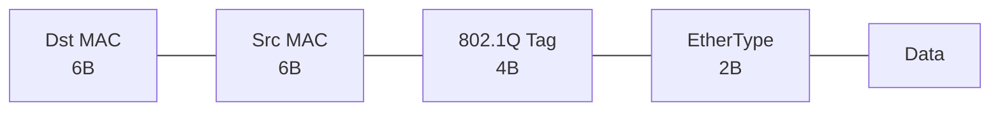
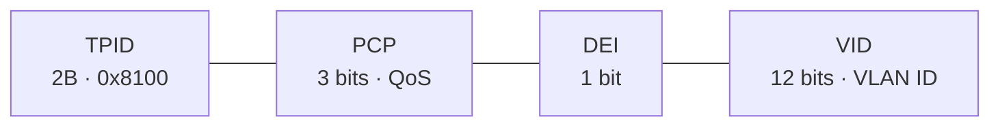

## What is a VLAN

A VLAN (Virtual LAN) is a logical network segment that creates a separate broadcast domain on a switch. Devices in different VLANs cannot communicate without a router.

**VLAN Ranges:**

| Range | Name | Description |
|---|---|---|
| 1 | Default VLAN | All ports by default; cannot be deleted |
| 2–1001 | Normal Range | User-defined VLANs |
| 1002–1005 | Legacy | FDDI/Token Ring (cannot be deleted) |
| 1006–4094 | Extended Range | Requires VTP Transparent/Off |

> **⚠️ Note:** VLAN 1 is the default Native VLAN. It is recommended to change the native VLAN to an unused number for security reasons.

---

## Switch Port Types

| Type | Description | Tagging |
|---|---|---|
| Access | Belongs to one VLAN; connects end devices | Untagged |
| Trunk | Carries multiple VLANs; connects switch-to-switch or switch-to-router | Tagged (802.1Q) |
| Voice | Access port + separate voice VLAN for IP phones | Untagged (data) + tagged (voice) |

---

## 802.1Q Tagging

802.1Q inserts a 4-byte tag into the Ethernet frame header:



802.1Q Tag (4 bytes):



**Native VLAN** — frames in this VLAN are sent over the trunk untagged.

---

## Configuring VLANs and Access Ports

```bash
# Create VLANs
Switch(config)# vlan 10
Switch(config-vlan)# name SALES
Switch(config)# vlan 20
Switch(config-vlan)# name ENGINEERING

# Access port
Switch(config)# interface fastethernet 0/1
Switch(config-if)# switchport mode access
Switch(config-if)# switchport access vlan 10
Switch(config-if)# description PC-Sales

# Multiple ports at once (range)
Switch(config)# interface range fastethernet 0/1-10
Switch(config-if-range)# switchport mode access
Switch(config-if-range)# switchport access vlan 10

# Voice VLAN (for IP phone)
Switch(config)# interface fastethernet 0/5
Switch(config-if)# switchport mode access
Switch(config-if)# switchport access vlan 10        # data
Switch(config-if)# switchport voice vlan 100         # voice

# Save VLANs (on some switches stored in flash:vlan.dat)
Switch# copy running-config startup-config
```

---

## Configuring Trunk Ports

```bash
# Trunk port (between switches)
Switch(config)# interface gigabitethernet 0/1
Switch(config-if)# switchport mode trunk
Switch(config-if)# switchport trunk encapsulation dot1q    # for Layer 3 switches
Switch(config-if)# switchport trunk native vlan 99         # change native VLAN
Switch(config-if)# switchport trunk allowed vlan 10,20,30  # permitted VLANs
Switch(config-if)# switchport trunk allowed vlan add 40    # add VLAN
Switch(config-if)# switchport trunk allowed vlan remove 40 # remove VLAN
Switch(config-if)# switchport trunk allowed vlan all       # all VLANs

# DTP (Dynamic Trunking Protocol) — auto-negotiation
Switch(config-if)# switchport mode dynamic desirable  # tries to become trunk
Switch(config-if)# switchport mode dynamic auto       # becomes trunk if partner desires
Switch(config-if)# switchport nonegotiate             # disable DTP (recommended!)
```

> **📌 Important:** For security, always explicitly set `switchport mode trunk` or `switchport mode access`. Disable DTP with `switchport nonegotiate`. VLAN hopping attacks exploit automatic DTP negotiation.

---

## Inter-VLAN Routing

### Option 1: Router-on-a-Stick (subinterfaces)

```bash
# On the switch: trunk to router
Switch(config)# interface gigabitethernet 0/1
Switch(config-if)# switchport mode trunk

# On the router: subinterfaces
Router(config)# interface gigabitethernet 0/0.10
Router(config-subif)# encapsulation dot1q 10
Router(config-subif)# ip address 192.168.10.1 255.255.255.0

Router(config)# interface gigabitethernet 0/0.20
Router(config-subif)# encapsulation dot1q 20
Router(config-subif)# ip address 192.168.20.1 255.255.255.0

Router(config)# interface gigabitethernet 0/0
Router(config-if)# no shutdown
```

### Option 2: SVI on a Layer 3 Switch

```bash
# Enable IP routing on L3 switch
Switch(config)# ip routing

# Create SVI (Switch Virtual Interface)
Switch(config)# interface vlan 10
Switch(config-if)# ip address 192.168.10.1 255.255.255.0
Switch(config-if)# no shutdown

Switch(config)# interface vlan 20
Switch(config-if)# ip address 192.168.20.1 255.255.255.0
Switch(config-if)# no shutdown

# Routed port (L3 switch, no switchport)
Switch(config)# interface gigabitethernet 0/1
Switch(config-if)# no switchport
Switch(config-if)# ip address 10.0.0.1 255.255.255.252
```

---

## VTP (VLAN Trunking Protocol)

VTP synchronizes VLAN information between switches over trunk links.

| VTP Mode | Description |
|---|---|
| Server | Creates, modifies, deletes VLANs; sends updates |
| Client | Receives updates; cannot create VLANs |
| Transparent | Does not participate in VTP; forwards updates; uses local VLANs |
| Off (VTP v3) | Completely disabled |

> **⚠️ Note:** VTP is dangerous: a new switch with a higher revision number can overwrite the VLAN database of the entire network. It is recommended to use VTP Transparent or Off, or configure VLANs manually.

```bash
Switch(config)# vtp mode server          # or client, transparent
Switch(config)# vtp domain CCNA
Switch(config)# vtp password cisco123
Switch# show vtp status
```

---

## Verification and Diagnostics

```bash
# VLANs
Switch# show vlan brief                         # all VLANs and ports
Switch# show vlan id 10                         # specific VLAN
Switch# show interfaces fastethernet 0/1 switchport  # port mode

# Trunk
Switch# show interfaces trunk                   # all trunk ports
Switch# show interfaces gigabitethernet 0/1 trunk

# VTP
Switch# show vtp status
Switch# show vtp counters

# Remove VLAN
Switch(config)# no vlan 10
Switch# delete flash:vlan.dat              # full VLAN database reset
Switch# erase startup-config
Switch# reload
```

---

## Resources

| Resource | Description |
|---|---|
| [IEEE 802.1Q Standard](https://standards.ieee.org/ieee/802.1Q/6844/) | Official VLAN trunking 802.1Q standard |
| [VLANs — networklessons.com](https://networklessons.com/cisco/ccna-routing-switching-icnd1-100-105/introduction-to-vlans) | Introduction to VLANs, access/trunk ports, native VLAN |
| [Inter-VLAN Routing — networklessons.com](https://networklessons.com/cisco/ccna-routing-switching-icnd1-100-105/inter-vlan-routing) | Router-on-a-stick, L3 switch: inter-VLAN routing |
| [DTP and VTP — networklessons.com](https://networklessons.com/cisco/ccna-routing-switching-icnd2-200-105/vtp-vlan-trunking-protocol) | Dynamic Trunking Protocol and VLAN Trunking Protocol |
| [Jeremy's IT Lab — VLANs and Trunk Ports (YouTube)](https://www.youtube.com/watch?v=2p8Zv5Md8Xo) | VLANs, 802.1Q, trunk, DTP from the Free CCNA series |
| [Cisco VLAN Configuration Guide](https://www.cisco.com/c/en/us/td/docs/switches/lan/catalyst9300/software/release/17-3/configuration_guide/vlan/b_173_vlan_9300_cg.html) | Official Cisco guide for VLAN configuration on Catalyst |
