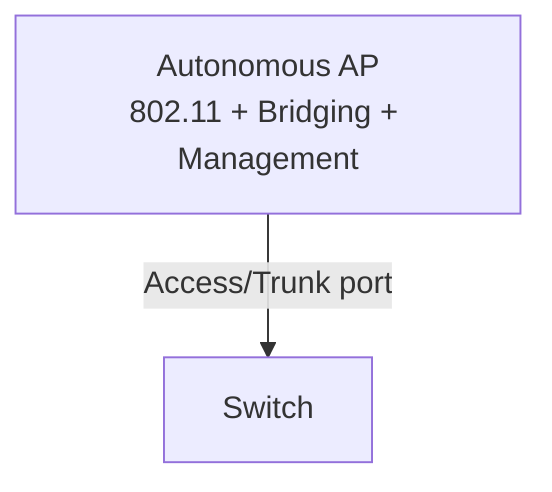

## WLAN Architectures

| Architecture | Description | Management |
|---|---|---|
| Autonomous AP | Independent AP; full configuration on each AP | Local (CLI/GUI) |
| Lightweight AP (CAPWAP) | AP without intelligence; managed centrally by WLC | WLC |
| Cloud-based | Managed through cloud (Cisco Meraki) | Cloud controller |

---

## Autonomous AP

- Full functionality configured directly on the AP
- Suitable for small networks (1–5 APs)
- Each AP must be configured and updated individually
- AP connected to switch: trunk port or access port



---

## Lightweight AP and WLC

Functions are split between AP and WLC (Split-MAC architecture):

| Function | Lightweight AP | WLC |
|---|:---:|:---:|
| RF signal transmission/reception | ✓ | |
| 802.11 encryption | ✓ | |
| Beacons | ✓ | |
| Client authentication | | ✓ |
| SSID/VLAN management | | ✓ |
| RF policies | | ✓ |
| Roaming | | ✓ |
| Security | | ✓ |


---

## CAPWAP

**CAPWAP** (Control And Provisioning of Wireless Access Points) — tunneling protocol between Lightweight AP and WLC.

| Tunnel | Port | Content |
|---|---|---|
| Control | UDP 5246 | AP management, configuration |
| Data | UDP 5247 | Client traffic (encapsulated) |

- Uses DTLS to encrypt the control channel
- AP gets its IP address from DHCP (option 43 — WLC address)
- AP discovers WLC: broadcast → DNS → DHCP option 43 → Mobility Group

### Data Traffic Modes in CAPWAP

| Mode | Description |
|---|---|
| Central Switching (default) | Traffic is tunneled to WLC, then forwarded to network |
| Local Switching (FlexConnect) | Traffic exits locally at the AP (without WLC) |

---

## WLC Deployment

### AP Operating Modes (FlexConnect / Local)

| AP Mode | Description |
|---|---|
| Local mode | Serves clients; tunnel to WLC |
| FlexConnect | Serves clients locally when WLC connection is lost |
| Monitor | RF monitoring only (IDS); does not serve clients |
| Sniffer | Packet capture |
| Rogue Detector | Detects unauthorized APs |
| Bridge | Mesh/wireless bridge |

### WLC Placement in the Network

| Option | Description |
|---|---|
| Unified (Hardware WLC) | Dedicated physical device (Cisco 3504, 5520) |
| Embedded (in router) | WLC embedded in ISR router |
| Mobility Express | WLC function built into AP (for small networks) |
| Cloud-based (Meraki) | Management via cloud portal |

---

## Commands and Verification

```bash
# On Lightweight AP (through WLC or locally with FlexConnect)
AP# show capwap client rcb            # CAPWAP information
AP# show dot11 associations           # clients on AP
AP# debug capwap errors               # debug

# WLC view (GUI: Wireless > Access Points)
# WLC CLI:
WLC# show ap summary                  # all APs
WLC# show ap config general AP-Name   # specific AP configuration
WLC# show client summary              # clients
WLC# show interface summary           # WLC interfaces
WLC# show wlan summary                # WLAN profiles

# On switch (port for AP)
Switch(config)# interface gigabitethernet 0/10
Switch(config-if)# switchport mode trunk             # or access
Switch(config-if)# switchport trunk native vlan 10   # AP management VLAN
Switch(config-if)# spanning-tree portfast trunk      # speed up port-up transition
```

> **💡 Tip:** The switch port for a Lightweight AP is typically configured as a **trunk** to carry multiple SSIDs/VLANs over a single physical AP↔switch link.

---

## Resources

| Resource | Description |
|---|---|
| [Cisco WLC Configuration Guide](https://www.cisco.com/c/en/us/td/docs/wireless/controller/9800/config-guide/b_wl_16_10_cg.html) | Official Cisco Wireless LAN Controller documentation |
| [CAPWAP — RFC 5415](https://www.rfc-editor.org/rfc/rfc5415) | Control and Provisioning of Wireless Access Points (CAPWAP) |
| [Lightweight AP vs Autonomous AP — networklessons.com](https://networklessons.com/cisco/ccna-routing-switching-icnd1-100-105/cisco-wireless-architectures) | Architecture comparison: Autonomous, Lightweight, Cloud-managed |
| [FlexConnect — Cisco](https://www.cisco.com/c/en/us/td/docs/wireless/controller/technotes/flexconnect-design-guide.html) | Cisco FlexConnect: AP operation when WLC connection is lost |
| [Jeremy's IT Lab — Wireless Architectures (YouTube)](https://www.youtube.com/watch?v=2vMHpH0bX7Y) | Autonomous AP, Lightweight AP, WLC, CAPWAP from the Free CCNA series |
| [Cisco DNA Center Wireless — Cisco](https://www.cisco.com/c/en/us/products/cloud-systems-management/dna-center/index.html) | Managing wireless networks through DNA Center |
