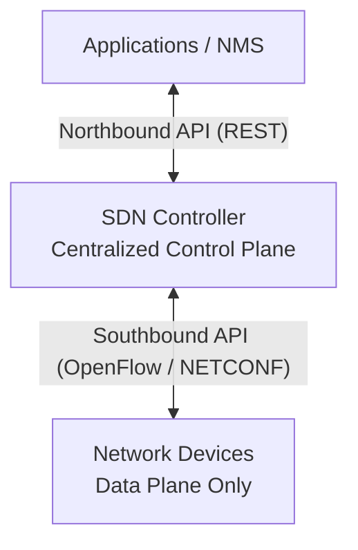
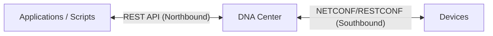

## Traditional Networks vs SDN

| Aspect | Traditional Networks | SDN |
|---|---|---|
| Management | CLI on each device | Centralized controller |
| Configuration | Manual, one device at a time | Via API and policies |
| Flexibility | Low | High |
| Visibility | Limited | End-to-end |
| Errors | Frequent (manual input) | Reduced through automation |

---

## Network Device Planes

| Plane | Name | Description |
|---|---|---|
| Data Plane | Forwarding plane | Packet forwarding (FIB/CAM/TCAM) |
| Control Plane | Control plane | Route computation (OSPF, STP, ARP) |
| Management Plane | Management plane | SSH, SNMP, NetConf — device configuration |

### In SDN:
- The **Control Plane** is moved to a **centralized controller**
- Devices (data plane) receive forwarding rules from the controller via protocols (OpenFlow, NETCONF/YANG)

### Northbound and Southbound APIs

| API | Direction | Purpose | Protocols |
|---|---|---|---|
| Northbound | Controller ↔ Applications/NMS | Manage the controller from applications | REST, RESTCONF |
| Southbound | Controller ↔ Devices | Program device forwarding rules | OpenFlow, NETCONF, YANG |

---

## SDN Architectures

| Type | Description |
|---|---|
| Pure SDN | Fully centralized control plane (OpenFlow) |
| Hybrid SDN | Part of the control plane on the controller, part on devices |
| SD-WAN | SDN for WAN (Cisco Viptela/SD-WAN) |
| Cisco ACI | Application Centric Infrastructure for data centers |

---

## Cisco DNA Center

**Cisco DNA Center (Catalyst Center)** is a network automation and management platform.

### DNA Center Capabilities

| Feature | Description |
|---|---|
| Intent-Based Networking | Define intent ("allow VLAN 10 on all switches"), controller applies it |
| Network Discovery | Automatic device discovery |
| Network Design | Hierarchy: Global → Site → Building → Floor |
| Provision | Automated device configuration |
| Policy | Security groups (SGT), segmentation |
| Assurance | Monitoring, analytics, and troubleshooting |

### Interaction with Devices

### SD-Access

**SD-Access (Software-Defined Access)** is a Cisco solution for automating campus networks:
- **Fabric** — overlay network on top of the physical infrastructure (VXLAN + LISP)
- **Control Plane** — LISP for endpoint tracking
- **Data Plane** — VXLAN for tunneling
- **Policy Plane** — TrustSec/SGT for micro-segmentation

---

## Configuration Protocols

### NETCONF (RFC 6241)

- Transport: SSH (TCP 830)
- Data format: XML
- Operations: get, get-config, edit-config, copy-config

### RESTCONF (RFC 8040)

- Transport: HTTPS
- Data format: JSON or XML
- Methods: GET, POST, PUT, PATCH, DELETE
- Based on YANG data models

### YANG

**YANG** (Yet Another Next Generation) is a data modeling language for configuring network devices. It defines the structure and data types used in NETCONF/RESTCONF.

---

## Resources

| Resource | Description |
|---|---|
| [Cisco DNA Center Documentation](https://developer.cisco.com/docs/dna-center/) | Official DNA Center documentation: API, Intent API |
| [SDN Overview — networklessons.com](https://networklessons.com/cisco/ccna-routing-switching-icnd2-200-105/software-defined-networking-sdn) | SDN: control/data plane separation, OpenFlow, controllers |
| [Cisco SD-Access](https://www.cisco.com/c/en/us/solutions/enterprise-networks/software-defined-access/index.html) | SD-Access: fabric, underlay/overlay, policy, segmentation |
| [Jeremy's IT Lab — SDN and Automation (YouTube)](https://www.youtube.com/watch?v=UdmgpxTq6Yw) | SDN, DNA Center, management and automation from the Free CCNA series |
| [Cisco DevNet — DNA Center Sandbox](https://developer.cisco.com/site/sandbox/) | Free lab environment for learning the DNA Center API |
| [OpenFlow — Open Networking Foundation](https://opennetworking.org/sdn-definition/) | SDN definition and the OpenFlow protocol from ONF |
