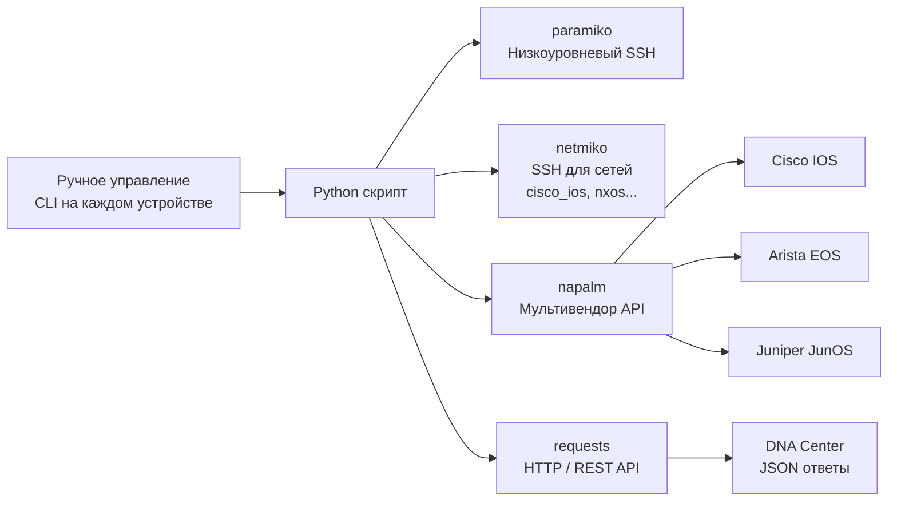

**Экзаменационная тема:** Domain 6 — Automation and Programmability
**Odom:** Vol.2, Ch. 15

---

## Зачем Python для сетей

| Задача | Вручную (CLI) | Python |
|---|---|---|
| Собрать `show version` с 50 роутеров | ~2 часа | ~30 секунд |
| Изменить VLAN на 100 коммутаторах | Весь день | 1 скрипт |
| Проверить соответствие конфигурации | Сложно | Автоматически |
| Получить данные из DNA Center API | Браузер | requests + JSON |

**Ключевые библиотеки для сетей:**

| Библиотека | Назначение |
|---|---|
| `paramiko` | Низкоуровневый SSH |
| `netmiko` | SSH для сетевых устройств (абстракция над paramiko) |
| `napalm` | Мультивендорный API (IOS, EOS, NX-OS, JunOS) |
| `nornir` | Фреймворк автоматизации (альтернатива Ansible) |
| `requests` | HTTP/REST API |
| `json` | Парсинг JSON-ответов |
| `re` | Регулярные выражения для парсинга CLI-вывода |

---

## Основы Python для сетевого инженера

### Структуры данных

```python
# Список устройств
devices = ["192.168.1.1", "192.168.1.2", "192.168.1.3"]

# Словарь — конфигурация устройства
device = {
    "host": "192.168.1.1",
    "username": "admin",
    "password": "cisco123",
    "device_type": "cisco_ios"
}

# Список словарей — несколько устройств
routers = [
    {"host": "10.0.0.1", "hostname": "R1"},
    {"host": "10.0.0.2", "hostname": "R2"},
]
```

### Циклы для итерации по устройствам

```python
for device_ip in devices:
    print(f"Подключаюсь к {device_ip}")
    # ... выполнить команду

# Перебор словаря
for router in routers:
    print(f"Устройство: {router['hostname']} — IP: {router['host']}")
```

### Функции

```python
def get_hostname(connection):
    output = connection.send_command("show version")
    # Парсинг через re или textfsm
    return output
```

---

## Paramiko — SSH вручную

**Paramiko** — низкоуровневая библиотека SSH. Требует ручного управления сессией.

```python
import paramiko
import time

ssh = paramiko.SSHClient()
ssh.set_missing_host_key_policy(paramiko.AutoAddPolicy())

ssh.connect(
    hostname="192.168.1.1",
    username="admin",
    password="cisco123",
    look_for_keys=False
)

# Для интерактивных сессий IOS нужен invoke_shell
shell = ssh.invoke_shell()
time.sleep(1)

shell.send("show ip interface brief\n")
time.sleep(2)

output = shell.recv(4096).decode("utf-8")
print(output)

ssh.close()
```

> Paramiko требует `time.sleep()` для ожидания вывода — неудобно. Netmiko решает эту проблему.

---

## Netmiko — упрощённый SSH

**Netmiko** — надстройка над paramiko с поддержкой десятков типов устройств.

```python
from netmiko import ConnectHandler

# Параметры подключения
cisco_router = {
    "device_type": "cisco_ios",     # Тип устройства
    "host": "192.168.1.1",
    "username": "admin",
    "password": "cisco123",
    "secret": "enable_pass",        # Enable пароль (опционально)
}

# Подключение и выполнение команды
with ConnectHandler(**cisco_router) as net_connect:
    output = net_connect.send_command("show ip interface brief")
    print(output)
```

### Выполнение нескольких команд

```python
with ConnectHandler(**cisco_router) as net_connect:
    # show команды
    output = net_connect.send_command("show version")

    # Переход в enable
    net_connect.enable()

    # Конфигурирование (config mode)
    config_commands = [
        "interface loopback 0",
        "ip address 1.1.1.1 255.255.255.255",
        "description MGMT",
        "no shutdown"
    ]
    net_connect.send_config_set(config_commands)

    # Сохранить конфигурацию
    net_connect.save_config()
```

### Массовая операция на нескольких устройствах

```python
from netmiko import ConnectHandler

devices = [
    {"device_type": "cisco_ios", "host": "10.0.0.1", "username": "admin", "password": "cisco"},
    {"device_type": "cisco_ios", "host": "10.0.0.2", "username": "admin", "password": "cisco"},
]

for device in devices:
    with ConnectHandler(**device) as conn:
        hostname = conn.send_command("show run | include hostname")
        version = conn.send_command("show version | include Version")
        print(f"{device['host']}: {hostname.strip()} — {version.strip()}")
```

### Типы устройств Netmiko

| device_type | Устройство |
|---|---|
| `cisco_ios` | Cisco IOS/IOS XE |
| `cisco_nxos` | Cisco NX-OS |
| `cisco_asa` | Cisco ASA |
| `cisco_xr` | Cisco IOS XR |
| `arista_eos` | Arista EOS |
| `juniper_junos` | Juniper JunOS |
| `linux` | Linux (SSH) |

---

## NAPALM — мультивендор

**NAPALM** (Network Automation and Programmability Abstraction Layer with Multivendor support) — единый API для разных ОС.

```python
from napalm import get_network_driver

# Инициализация драйвера
driver = get_network_driver("ios")
device = driver(
    hostname="192.168.1.1",
    username="admin",
    password="cisco123"
)

device.open()

# Получить факты устройства
facts = device.get_facts()
print(facts["hostname"])         # Hostname
print(facts["vendor"])           # Cisco
print(facts["model"])            # ISR4321
print(facts["os_version"])       # IOS XE version

# Получить интерфейсы
interfaces = device.get_interfaces()
for iface, data in interfaces.items():
    print(f"{iface}: up={data['is_up']}, mac={data['mac_address']}")

# Сравнение конфигураций (replace_candidate)
device.load_replace_candidate(filename="new_config.txt")
diff = device.compare_config()
print(diff)                      # Что изменится
device.commit_config()           # Применить

device.close()
```

---

## Работа с JSON и API

### Разбор JSON-ответа от DNA Center

```python
import requests
import json

# Получить токен аутентификации
auth_response = requests.post(
    "https://sandboxdnac.cisco.com/dna/system/api/v1/auth/token",
    auth=("devnetuser", "Cisco123!"),
    verify=False
)
token = auth_response.json()["Token"]

# Заголовки с токеном
headers = {
    "X-Auth-Token": token,
    "Content-Type": "application/json"
}

# Получить список устройств
devices_response = requests.get(
    "https://sandboxdnac.cisco.com/dna/intent/api/v1/network-device",
    headers=headers,
    verify=False
)

devices = devices_response.json()["response"]
for device in devices:
    print(f"{device['hostname']} — {device['managementIpAddress']} — {device['type']}")
```

### Структура JSON

```python
import json

# Парсинг JSON-строки
json_string = '{"hostname": "R1", "interfaces": ["Gi0/0", "Gi0/1"]}'
data = json.loads(json_string)
print(data["hostname"])            # R1
print(data["interfaces"][0])      # Gi0/0

# Сериализация в JSON
config = {"vlan": 10, "name": "Sales"}
print(json.dumps(config, indent=2))
```

---

## Типичные экзаменационные концепции

На экзамене CCNA от Python и автоматизации ожидают:

| Концепция | Что надо знать |
|---|---|
| Зачем Python | Автоматизация повторяющихся задач, масштабирование |
| Netmiko vs Paramiko | Netmiko — удобнее, специально для сетей |
| NAPALM | Единый API для разных вендоров |
| JSON | Формат данных в REST API (DNA Center, RESTCONF) |
| `requests` | Библиотека для HTTP-запросов к REST API |
| Идемпотентность | Применение скрипта дважды = тот же результат (как Ansible) |

> **💡 Совет:** На CCNA не требуется писать Python-код. Нужно понимать **зачем и что делают** эти инструменты. Реальные вопросы: "Какая библиотека используется для SSH к сетевым устройствам?", "Что такое NAPALM?", "Какой формат данных использует REST API?"

---



---

## Ресурсы

| Ресурс | Описание |
|---|---|
| [Netmiko — GitHub](https://github.com/ktbyers/netmiko) | Kirk Byers: Netmiko документация и примеры |
| [NAPALM — Read the Docs](https://napalm.readthedocs.io/) | NAPALM: поддерживаемые драйверы, методы, примеры |
| [Cisco DevNet — Network Automation](https://developer.cisco.com/network-automation/) | Cisco: Python, Ansible, YANG, RESTCONF примеры |
| [Jeremy's IT Lab — Python & Automation (YouTube)](https://www.youtube.com/watch?v=FdRaJxFcT_8) | Python для CCNA: netmiko, NAPALM, automation basics |
