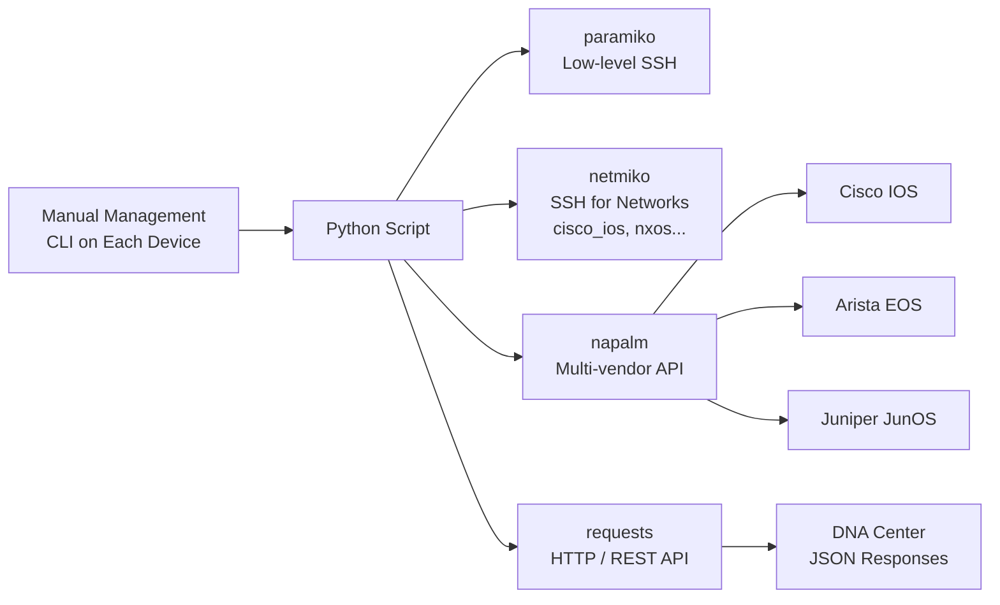

**Exam topic:** Domain 6 — Automation and Programmability
**Odom:** Vol.2, Ch. 15

---

## Why Python for Networks

| Task | Manually (CLI) | Python |
|---|---|---|
| Collect `show version` from 50 routers | ~2 hours | ~30 seconds |
| Change VLAN on 100 switches | All day | 1 script |
| Verify configuration compliance | Difficult | Automated |
| Retrieve data from DNA Center API | Browser | requests + JSON |

**Key libraries for networking:**

| Library | Purpose |
|---|---|
| `paramiko` | Low-level SSH |
| `netmiko` | SSH for network devices (abstraction over paramiko) |
| `napalm` | Multi-vendor API (IOS, EOS, NX-OS, JunOS) |
| `nornir` | Automation framework (alternative to Ansible) |
| `requests` | HTTP/REST API |
| `json` | JSON response parsing |
| `re` | Regular expressions for parsing CLI output |

---

## Python Basics for Network Engineers

### Data Structures

```python
# List of devices
devices = ["192.168.1.1", "192.168.1.2", "192.168.1.3"]

# Dictionary — device configuration
device = {
    "host": "192.168.1.1",
    "username": "admin",
    "password": "cisco123",
    "device_type": "cisco_ios"
}

# List of dictionaries — multiple devices
routers = [
    {"host": "10.0.0.1", "hostname": "R1"},
    {"host": "10.0.0.2", "hostname": "R2"},
]
```

### Loops for Iterating Over Devices

```python
for device_ip in devices:
    print(f"Connecting to {device_ip}")
    # ... execute command

# Iterating over a dictionary
for router in routers:
    print(f"Device: {router['hostname']} — IP: {router['host']}")
```

### Functions

```python
def get_hostname(connection):
    output = connection.send_command("show version")
    # Parse with re or textfsm
    return output
```

---

## Paramiko — Manual SSH

**Paramiko** is a low-level SSH library. Requires manual session management.

```python
import paramiko
import time

ssh = paramiko.SSHClient()
ssh.set_missing_host_key_policy(paramiko.AutoAddPolicy())

ssh.connect(
    hostname="192.168.1.1",
    username="admin",
    password="cisco123",
    look_for_keys=False
)

# Interactive IOS sessions require invoke_shell
shell = ssh.invoke_shell()
time.sleep(1)

shell.send("show ip interface brief\n")
time.sleep(2)

output = shell.recv(4096).decode("utf-8")
print(output)

ssh.close()
```

> Paramiko requires `time.sleep()` to wait for output — inconvenient. Netmiko solves this problem.

---

## Netmiko — Simplified SSH

**Netmiko** is a wrapper over paramiko with support for dozens of device types.

```python
from netmiko import ConnectHandler

# Connection parameters
cisco_router = {
    "device_type": "cisco_ios",     # Device type
    "host": "192.168.1.1",
    "username": "admin",
    "password": "cisco123",
    "secret": "enable_pass",        # Enable password (optional)
}

# Connect and execute a command
with ConnectHandler(**cisco_router) as net_connect:
    output = net_connect.send_command("show ip interface brief")
    print(output)
```

### Running Multiple Commands

```python
with ConnectHandler(**cisco_router) as net_connect:
    # show commands
    output = net_connect.send_command("show version")

    # Enter enable mode
    net_connect.enable()

    # Configuration mode
    config_commands = [
        "interface loopback 0",
        "ip address 1.1.1.1 255.255.255.255",
        "description MGMT",
        "no shutdown"
    ]
    net_connect.send_config_set(config_commands)

    # Save configuration
    net_connect.save_config()
```

### Bulk Operation on Multiple Devices

```python
from netmiko import ConnectHandler

devices = [
    {"device_type": "cisco_ios", "host": "10.0.0.1", "username": "admin", "password": "cisco"},
    {"device_type": "cisco_ios", "host": "10.0.0.2", "username": "admin", "password": "cisco"},
]

for device in devices:
    with ConnectHandler(**device) as conn:
        hostname = conn.send_command("show run | include hostname")
        version = conn.send_command("show version | include Version")
        print(f"{device['host']}: {hostname.strip()} — {version.strip()}")
```

### Netmiko Device Types

| device_type | Device |
|---|---|
| `cisco_ios` | Cisco IOS/IOS XE |
| `cisco_nxos` | Cisco NX-OS |
| `cisco_asa` | Cisco ASA |
| `cisco_xr` | Cisco IOS XR |
| `arista_eos` | Arista EOS |
| `juniper_junos` | Juniper JunOS |
| `linux` | Linux (SSH) |

---

## NAPALM — Multi-Vendor

**NAPALM** (Network Automation and Programmability Abstraction Layer with Multivendor support) — a unified API for different network OSes.

```python
from napalm import get_network_driver

# Initialize the driver
driver = get_network_driver("ios")
device = driver(
    hostname="192.168.1.1",
    username="admin",
    password="cisco123"
)

device.open()

# Get device facts
facts = device.get_facts()
print(facts["hostname"])         # Hostname
print(facts["vendor"])           # Cisco
print(facts["model"])            # ISR4321
print(facts["os_version"])       # IOS XE version

# Get interfaces
interfaces = device.get_interfaces()
for iface, data in interfaces.items():
    print(f"{iface}: up={data['is_up']}, mac={data['mac_address']}")

# Compare configurations (replace_candidate)
device.load_replace_candidate(filename="new_config.txt")
diff = device.compare_config()
print(diff)                      # What will change
device.commit_config()           # Apply

device.close()
```

---

## Working with JSON and APIs

### Parsing a JSON Response from DNA Center

```python
import requests
import json

# Get authentication token
auth_response = requests.post(
    "https://sandboxdnac.cisco.com/dna/system/api/v1/auth/token",
    auth=("devnetuser", "Cisco123!"),
    verify=False
)
token = auth_response.json()["Token"]

# Headers with token
headers = {
    "X-Auth-Token": token,
    "Content-Type": "application/json"
}

# Get device list
devices_response = requests.get(
    "https://sandboxdnac.cisco.com/dna/intent/api/v1/network-device",
    headers=headers,
    verify=False
)

devices = devices_response.json()["response"]
for device in devices:
    print(f"{device['hostname']} — {device['managementIpAddress']} — {device['type']}")
```

### JSON Structure

```python
import json

# Parse JSON string
json_string = '{"hostname": "R1", "interfaces": ["Gi0/0", "Gi0/1"]}'
data = json.loads(json_string)
print(data["hostname"])            # R1
print(data["interfaces"][0])      # Gi0/0

# Serialize to JSON
config = {"vlan": 10, "name": "Sales"}
print(json.dumps(config, indent=2))
```

---

## Key Exam Concepts

For the CCNA exam, Python and automation questions focus on:

| Concept | What to know |
|---|---|
| Why Python | Automate repetitive tasks, scale operations |
| Netmiko vs Paramiko | Netmiko — more convenient, purpose-built for networking |
| NAPALM | Unified API for multiple vendors |
| JSON | Data format used in REST APIs (DNA Center, RESTCONF) |
| `requests` | Library for HTTP requests to REST APIs |
| Idempotency | Running a script twice produces the same result (like Ansible) |

> **💡 Tip:** The CCNA exam does not require writing Python code. You need to understand **why and what** these tools do. Typical exam questions: "Which library is used for SSH to network devices?", "What is NAPALM?", "What data format does REST API use?"

---



---

## Resources

| Resource | Description |
|---|---|
| [Netmiko — GitHub](https://github.com/ktbyers/netmiko) | Kirk Byers: Netmiko documentation and examples |
| [NAPALM — Read the Docs](https://napalm.readthedocs.io/) | NAPALM: supported drivers, methods, examples |
| [Cisco DevNet — Network Automation](https://developer.cisco.com/network-automation/) | Cisco: Python, Ansible, YANG, RESTCONF examples |
| [Jeremy's IT Lab — Python & Automation (YouTube)](https://www.youtube.com/watch?v=FdRaJxFcT_8) | Python for CCNA: netmiko, NAPALM, automation basics |
