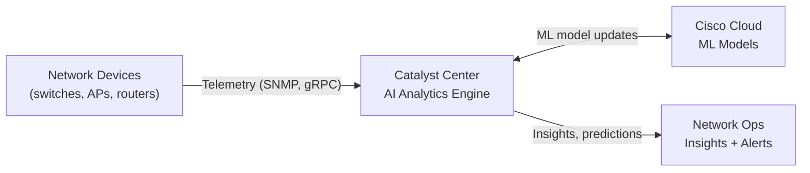

## What is AI and ML

**Artificial Intelligence (AI)**: simulation of human intelligence by computers: learning, reasoning, decision-making, and self-correction.

**Machine Learning (ML)**: a subset of AI where algorithms learn from data without being explicitly programmed. The system improves through pattern recognition.

```
AI ⊃ Machine Learning ⊃ Deep Learning
```

---

## Types of Machine Learning

| Type | How it works | Networking example |
|---|---|---|
| **Supervised learning** | Trained on labeled data (input → expected output) | Spam classification, malware detection |
| **Unsupervised learning** | Finds patterns in unlabeled data | Traffic anomaly detection, user clustering |
| **Reinforcement learning** | Learns by trial and error, optimizes a reward | Adaptive routing, load balancing |
| **Deep learning** | Multi-layer neural networks; handles complex patterns | Intrusion detection, voice recognition |

> **💡 Tip:** For the CCNA exam the key distinction is **supervised** (labeled data, known outputs) vs **unsupervised** (no labels, finds patterns). Deep learning is a subset of ML using neural networks.

---

## AI Subfields Relevant to Networking

| Subfield | Description | Example |
|---|---|---|
| **Predictive AI** | Analyzes historical data to forecast outcomes | Predicting link congestion, capacity planning |
| **Generative AI** | Creates new content (text, config, code) | ChatGPT, Cisco AI Assistant in Catalyst Center |
| **Natural Language Processing** | Understands and generates human language | Chatbots, voice-driven network queries |
| **Computer Vision** | Interprets visual information | Physical security cameras, data center monitoring |

---

## ML Applications in Networking

### Anomaly Detection

The most common ML use case in networking. The system learns **baseline behavior** (normal traffic patterns, CPU/memory usage) and flags deviations.

| Baseline metric | Anomaly example |
|---|---|
| Traffic volume per interface | Sudden spike → potential DDoS |
| Protocol distribution | Unexpected ICMP flood |
| Login times per user | Access at 3 AM from new location |

### Traffic Classification

**Supervised learning** classifies traffic as normal or malicious based on labeled training data.

| ML Task | Input | Output |
|---|---|---|
| Classification | Packet headers, flow stats | Normal / Suspicious / Malicious |
| Regression | Historical traffic data | Predicted bandwidth for next hour |

### Predictive Maintenance and Capacity Planning

| Prediction | Benefit |
|---|---|
| Link utilization trend | Upgrade before congestion occurs |
| Device failure probability | Replace hardware proactively |
| Latency increase forecast | Reroute traffic in advance |

### Load Balancing

Reinforcement learning automatically redistributes traffic across paths to optimize performance and avoid congestion, adapting in real time without manual intervention.

---

## Traditional vs AI-Driven Network Operations

| Aspect | Traditional | AI-Driven |
|---|---|---|
| Fault detection | Threshold-based alerts (static) | Behavioral baseline + anomaly detection |
| Root cause analysis | Manual investigation | Automated correlation of symptoms |
| Capacity planning | Periodic manual review | Continuous predictive forecasting |
| Security | Known signature matching | Unknown threat detection via behavior |
| Configuration | CLI / scripts | Intent-based + AI recommendations |

---

## Cisco Catalyst Center AI Analytics

Cisco Catalyst Center (formerly DNA Center) includes **AI Network Analytics**, a cloud-delivered ML engine.

| Feature | Description |
|---|---|
| **Baseline learning** | Learns normal behavior per device, SSID, client |
| **Anomaly detection** | Alerts when metrics deviate from learned baseline |
| **Issue correlation** | Groups related symptoms into a single root cause |
| **AI-driven assurance** | Predicts problems before users are impacted |
| **Comparative analytics** | Compares your network to similar networks (peer benchmarking) |



---

## Neural Networks: Basics

A **neural network** is a model loosely inspired by the human brain:

| Component | Description |
|---|---|
| Neuron | Processes input, applies a weight, passes output |
| Layer | Group of neurons (input → hidden → output) |
| Weight | Strength of connection between neurons |
| Training | Adjusting weights to minimize prediction error |

**Deep learning** uses networks with many hidden layers, effective for complex patterns like speech recognition or intrusion detection.

---

## Large Language Models (LLMs)

**LLMs** (e.g., ChatGPT, Gemini, Claude) are generative AI models trained on massive text datasets. In networking context:

- Generate configuration templates from natural language
- Answer troubleshooting questions
- Summarize log files and alerts
- Cisco's AI Assistant in Catalyst Center uses LLM for natural language queries

> **📌 Note:** The CCNA exam does not require deep knowledge of LLMs, know what they are and their high-level use cases in network management.

---

## Key Exam Concepts

| Concept | What to know |
|---|---|
| AI vs ML | AI is the broad field; ML is a subset that learns from data |
| Supervised learning | Labeled data, classification/regression tasks |
| Unsupervised learning | No labels, finds patterns: used for anomaly detection |
| Anomaly detection | Learns baseline, flags deviations: key security use case |
| Predictive analytics | Forecasts future states (bandwidth, failure) |
| Generative AI | Creates new content; LLMs as example |
| Catalyst Center AI | AI-driven assurance, baseline learning, issue correlation |

> **💡 Tip:** The CCNA exam focuses on **what** AI/ML does in networks, not **how** the algorithms work mathematically. Expect questions on use cases, types of learning, and tools like Catalyst Center AI Analytics.

---

## Resources

| Resource | Description |
|---|---|
| [AI and ML (networklessons.com)](https://networklessons.com/cisco/ccna-200-301/artificial-intelligence-ai-and-machine-learning-ml) | AI/ML for CCNA: types of learning, networking applications |
| [Cisco AI Network Analytics](https://www.cisco.com/c/en/us/products/analytics/ai-network-analytics/index.html) | Cisco's AI-driven assurance platform: anomaly detection, predictions |
| [Jeremy's IT Lab: AI and ML (YouTube)](https://www.youtube.com/results?search_query=jeremy+it+lab+ccna+AI+ML) | AI/ML from the Free CCNA series |
| [Cisco Catalyst Center AI Assistant](https://blogs.cisco.com/networking/catalyst-center-ai-assistant) | Natural language queries and AI-driven insights in Catalyst Center |
