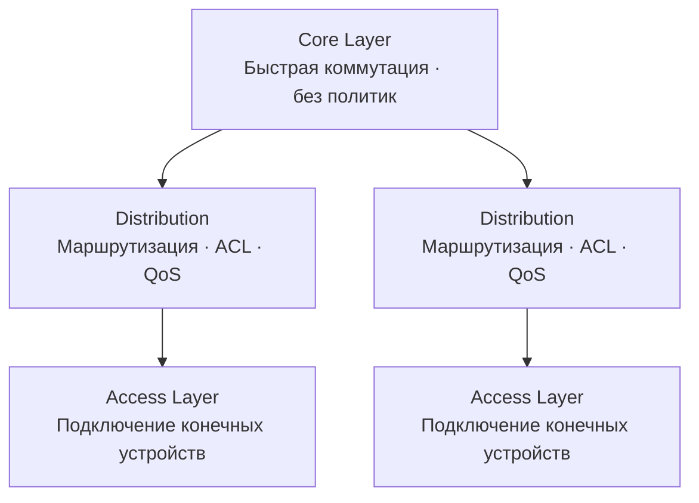

## Типы сетей по масштабу

| Тип | Название | Охват |
|---|---|---|
| PAN | Personal Area Network | Несколько метров (Bluetooth) |
| LAN | Local Area Network | Здание, офис |
| MAN | Metropolitan Area Network | Город |
| WAN | Wide Area Network | Страна, мир |
| WLAN | Wireless LAN | Беспроводная локальная |
| SAN | Storage Area Network | Сеть хранения данных |

---

## Физические топологии

| Топология | Описание | Плюсы | Минусы |
|---|---|---|---|
| Шина (Bus) | Все узлы на одном кабеле | Дёшево | Один обрыв — вся сеть |
| Звезда (Star) | Все узлы подключены к центральному коммутатору | Надёжность, масштабируемость | Зависимость от центра |
| Кольцо (Ring) | Узлы соединены в кольцо | Предсказуемо | Сложный сбой |
| Сетка (Mesh) | Каждый узел связан с несколькими | Высокая отказоустойчивость | Дорого |
| Гибридная | Комбинация топологий | Гибкость | Сложность |

> **💡 Совет:** Современные корпоративные сети строятся на топологии **звезда** (физически) — все устройства подключены к коммутаторам доступа.

---

## Логические топологии

Логическая топология описывает, как данные фактически передаются в сети, независимо от физической разводки.

- **Ethernet** — логическая шина (CSMA/CD в старых версиях), сейчас работает в режиме point-to-point через коммутаторы
- **Wi-Fi (802.11)** — логическая шина (CSMA/CA)
- **Token Ring** — логическое кольцо (устарело)

---

## Характеристики сетей

| Характеристика | Описание |
|---|---|
| Пропускная способность (Bandwidth) | Максимальный объём данных за единицу времени |
| Пропускная способность реальная (Throughput) | Фактически переданные данные |
| Задержка (Latency) | Время от отправки до получения |
| Джиттер (Jitter) | Вариация задержки (критично для VoIP) |
| Потери пакетов (Packet loss) | % пакетов не достигших цели |

---

## Трёхуровневая иерархическая модель Cisco

| Уровень | Функции |
|---|---|
| Core (ядро) | Высокоскоростная коммутация, минимальные задержки, без политик |
| Distribution (распределение) | Маршрутизация, ACL, суммаризация маршрутов, QoS |
| Access (доступ) | Подключение конечных устройств, PoE, Port Security, VLANs |

---

## Широковещательные и коллизионные домены

| Понятие | Определяется | Разделяется |
|---|---|---|
| Коллизионный домен | Сегмент общей среды | Коммутатором (каждый порт — отдельный) |
| Широковещательный домен | Набор устройств, получающих broadcast | Маршрутизатором или VLAN |

> **📌 Обратите внимание:** Коммутатор разделяет коллизионные домены (по одному на порт), но **не** разделяет широковещательный домен. Маршрутизатор разделяет оба типа доменов.

---

## Ресурсы

| Ресурс | Описание |
|---|---|
| [Network Topologies — networklessons.com](https://networklessons.com/cisco/ccna-routing-switching-icnd1-100-105/network-topologies) | Обзор физических и логических топологий сети |
| [Three-Tier Network Architecture — Cisco](https://www.cisco.com/c/en/us/td/docs/solutions/Enterprise/Campus/campover.html) | Cisco Campus Network Design: Access, Distribution, Core |
| [Jeremy's IT Lab — Network Topology Architectures (YouTube)](https://www.youtube.com/watch?v=Wm2rOA2Vrv0) | Урок по топологиям и трёхуровневой модели из серии Free CCNA |
| [Collision vs Broadcast Domain — networklessons.com](https://networklessons.com/cisco/ccna-routing-switching-icnd1-100-105/collision-broadcast-domain) | Разница между коллизионным и широковещательным доменом |
| [Spine-Leaf Architecture — Cisco](https://www.cisco.com/c/en/us/solutions/data-center-virtualization/what-is-a-spine-and-leaf-architecture.html) | Объяснение Spine-Leaf топологии для ЦОД |
