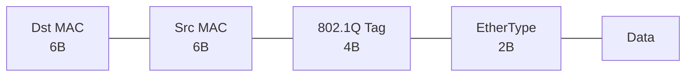
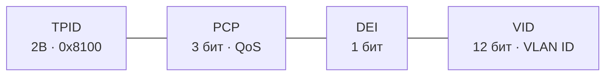

## Что такое VLAN

VLAN (Virtual LAN) — логический сегмент сети, создающий отдельный широковещательный домен на коммутаторе. Устройства в разных VLAN не могут общаться без маршрутизатора.

**Диапазоны VLAN:**

| Диапазон | Название | Описание |
|---|---|---|
| 1 | Default VLAN | Все порты по умолчанию, нельзя удалить |
| 2–1001 | Normal Range | Пользовательские VLAN |
| 1002–1005 | Legacy | FDDI/Token Ring (нельзя удалить) |
| 1006–4094 | Extended Range | Требует VTP Transparent/Off |

> **⚠️ Важно:** VLAN 1 — Native VLAN по умолчанию. Рекомендуется сменить native VLAN на неиспользуемый номер из соображений безопасности.

---

## Типы портов коммутатора

| Тип | Описание | Тегирование |
|---|---|---|
| Access | Принадлежит одному VLAN, подключение конечных устройств | Без тега |
| Trunk | Несёт несколько VLAN, соединение коммутатор–коммутатор или коммутатор–маршрутизатор | С тегом 802.1Q |
| Voice | Access + отдельный voice VLAN для IP-телефона | Нетегированный (data) + тег (voice) |

---

## Тегирование 802.1Q

802.1Q добавляет 4-байтный тег в заголовок Ethernet-фрейма:



802.1Q Tag (4 байта):



**Native VLAN** — фреймы этого VLAN передаются по trunk без тега.

---

## Настройка VLAN и Access-портов

```bash
# Создание VLAN
Switch(config)# vlan 10
Switch(config-vlan)# name SALES
Switch(config)# vlan 20
Switch(config-vlan)# name ENGINEERING

# Access-порт
Switch(config)# interface fastethernet 0/1
Switch(config-if)# switchport mode access
Switch(config-if)# switchport access vlan 10
Switch(config-if)# description PC-Sales

# Несколько портов сразу (range)
Switch(config)# interface range fastethernet 0/1-10
Switch(config-if-range)# switchport mode access
Switch(config-if-range)# switchport access vlan 10

# Voice VLAN (для IP-телефона)
Switch(config)# interface fastethernet 0/5
Switch(config-if)# switchport mode access
Switch(config-if)# switchport access vlan 10        # данные
Switch(config-if)# switchport voice vlan 100         # голос

# Сохранение VLAN (для некоторых коммутаторов в flash:vlan.dat)
Switch# copy running-config startup-config
```

---

## Настройка Trunk-портов

```bash
# Trunk-порт (между коммутаторами)
Switch(config)# interface gigabitethernet 0/1
Switch(config-if)# switchport mode trunk
Switch(config-if)# switchport trunk encapsulation dot1q    # для Layer 3 коммутаторов
Switch(config-if)# switchport trunk native vlan 99         # сменить native VLAN
Switch(config-if)# switchport trunk allowed vlan 10,20,30  # разрешённые VLAN
Switch(config-if)# switchport trunk allowed vlan add 40    # добавить VLAN
Switch(config-if)# switchport trunk allowed vlan remove 40 # убрать VLAN
Switch(config-if)# switchport trunk allowed vlan all       # все VLAN

# DTP (Dynamic Trunking Protocol) — автосогласование
Switch(config-if)# switchport mode dynamic desirable  # пытается стать trunk
Switch(config-if)# switchport mode dynamic auto       # становится trunk если партнёр желает
Switch(config-if)# switchport nonegotiate             # отключить DTP (рекомендуется!)
```

> **📌 Обратите внимание:** Для безопасности всегда явно задавайте `switchport mode trunk` или `switchport mode access`. Отключите DTP командой `switchport nonegotiate`. Атака VLAN Hopping использует автоматическое согласование DTP.

---

## Inter-VLAN маршрутизация

### Вариант 1: Router-on-a-Stick (подынтерфейсы)

```bash
# На коммутаторе: trunk на маршрутизатор
Switch(config)# interface gigabitethernet 0/1
Switch(config-if)# switchport mode trunk

# На маршрутизаторе: подынтерфейсы
Router(config)# interface gigabitethernet 0/0.10
Router(config-subif)# encapsulation dot1q 10
Router(config-subif)# ip address 192.168.10.1 255.255.255.0

Router(config)# interface gigabitethernet 0/0.20
Router(config-subif)# encapsulation dot1q 20
Router(config-subif)# ip address 192.168.20.1 255.255.255.0

Router(config)# interface gigabitethernet 0/0
Router(config-if)# no shutdown
```

### Вариант 2: SVI на Layer 3 коммутаторе

```bash
# Включить IP-маршрутизацию на L3-коммутаторе
Switch(config)# ip routing

# Создать SVI (Switch Virtual Interface)
Switch(config)# interface vlan 10
Switch(config-if)# ip address 192.168.10.1 255.255.255.0
Switch(config-if)# no shutdown

Switch(config)# interface vlan 20
Switch(config-if)# ip address 192.168.20.1 255.255.255.0
Switch(config-if)# no shutdown

# Routed port (L3 коммутатор, без switchport)
Switch(config)# interface gigabitethernet 0/1
Switch(config-if)# no switchport
Switch(config-if)# ip address 10.0.0.1 255.255.255.252
```

---

## VTP (VLAN Trunking Protocol)

VTP синхронизирует информацию о VLAN между коммутаторами через trunk-линки.

| Режим VTP | Описание |
|---|---|
| Server | Создаёт, изменяет, удаляет VLAN; рассылает обновления |
| Client | Получает обновления, не может создавать VLAN |
| Transparent | Не участвует в VTP, пересылает обновления, локальные VLAN |
| Off (VTP v3) | Полностью отключён |

> **⚠️ Важно:** VTP опасен: новый коммутатор с более высоким revision number может затереть VLAN-базу всей сети. Рекомендуется использовать VTP Transparent или Off, либо настраивать VLAN вручную.

```bash
Switch(config)# vtp mode server          # или client, transparent
Switch(config)# vtp domain CCNA
Switch(config)# vtp password cisco123
Switch# show vtp status
```

---

## Проверка и диагностика

```bash
# VLAN
Switch# show vlan brief                         # все VLAN и порты
Switch# show vlan id 10                         # конкретный VLAN
Switch# show interfaces fastethernet 0/1 switchport  # режим порта

# Trunk
Switch# show interfaces trunk                   # все trunk-порты
Switch# show interfaces gigabitethernet 0/1 trunk

# VTP
Switch# show vtp status
Switch# show vtp counters

# Удаление VLAN
Switch(config)# no vlan 10
Switch# delete flash:vlan.dat              # полный сброс VLAN-базы
Switch# erase startup-config
Switch# reload
```

---

## Ресурсы

| Ресурс | Описание |
|---|---|
| [IEEE 802.1Q Standard](https://standards.ieee.org/ieee/802.1Q/6844/) | Официальный стандарт VLAN trunking 802.1Q |
| [VLANs — networklessons.com](https://networklessons.com/cisco/ccna-routing-switching-icnd1-100-105/introduction-to-vlans) | Введение в VLANы, access/trunk порты, native VLAN |
| [Inter-VLAN Routing — networklessons.com](https://networklessons.com/cisco/ccna-routing-switching-icnd1-100-105/inter-vlan-routing) | Router-on-a-stick, L3-коммутатор: маршрутизация между VLANами |
| [DTP and VTP — networklessons.com](https://networklessons.com/cisco/ccna-routing-switching-icnd2-200-105/vtp-vlan-trunking-protocol) | Dynamic Trunking Protocol и VLAN Trunking Protocol |
| [Jeremy's IT Lab — VLANs and Trunk Ports (YouTube)](https://www.youtube.com/watch?v=2p8Zv5Md8Xo) | VLANы, 802.1Q, trunk, DTP из серии Free CCNA |
| [Cisco VLAN Configuration Guide](https://www.cisco.com/c/en/us/td/docs/switches/lan/catalyst9300/software/release/17-3/configuration_guide/vlan/b_173_vlan_9300_cg.html) | Официальное руководство по настройке VLANов на Catalyst |
