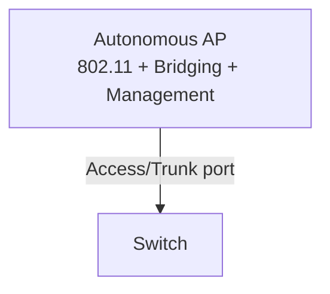
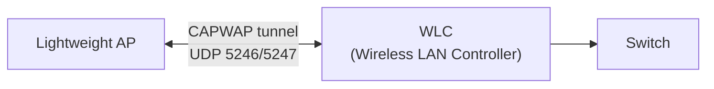

## Архитектуры WLAN

| Архитектура | Описание | Управление |
|---|---|---|
| Autonomous AP | Независимая AP, полная конфигурация на каждой AP | Локально (CLI/GUI) |
| Lightweight AP (CAPWAP) | AP без интеллекта, управляется WLC централизованно | WLC |
| Cloud-based | Управление через облако (Cisco Meraki) | Облачный контроллер |

---

## Autonomous AP

- Полная функциональность конфигурируется на AP напрямую
- Подходит для малых сетей (1–5 AP)
- Каждую AP нужно настраивать и обновлять отдельно
- AP подключена к коммутатору: trunk-порт или access-порт



---

## Lightweight AP и WLC

Функции разделены между AP и WLC (Split-MAC архитектура):

| Функция | Lightweight AP | WLC |
|---|:---:|:---:|
| Передача/приём RF сигнала | ✓ | |
| Шифрование 802.11 | ✓ | |
| Маяки (Beacons) | ✓ | |
| Аутентификация клиента | | ✓ |
| Управление SSID/VLAN | | ✓ |
| RF-политики | | ✓ |
| Роуминг | | ✓ |
| Безопасность | | ✓ |



---

## CAPWAP

**CAPWAP** (Control And Provisioning of Wireless Access Points) — протокол туннелирования между Lightweight AP и WLC.

| Тоннель | Порт | Содержимое |
|---|---|---|
| Control | UDP 5246 | Управление AP, конфигурация |
| Data | UDP 5247 | Клиентский трафик (инкапсулированный) |

- Использует DTLS для шифрования управляющего канала
- AP получает IP-адрес от DHCP (option 43 — адрес WLC)
- AP обнаруживает WLC: broadcast → DNS → DHCP option 43 → Mobility Group

### Режимы трафика данных в CAPWAP

| Режим | Описание |
|---|---|
| Central Switching (по умолч.) | Трафик туннелируется на WLC, потом в сеть |
| Local Switching (FlexConnect) | Трафик выходит локально на AP (без WLC) |

---

## Развёртывание WLC

### Режимы работы AP (FlexConnect / Local)

| Режим AP | Описание |
|---|---|
| Local mode | Обслуживает клиентов, туннель к WLC |
| FlexConnect | Обслуживает клиентов локально при разрыве с WLC |
| Monitor | Только мониторинг RF (IDS), не обслуживает клиентов |
| Sniffer | Захват пакетов |
| Rogue Detector | Обнаружение несанкционированных AP |
| Bridge | Mesh/беспроводной мост |

### Размещение WLC в сети

| Вариант | Описание |
|---|---|
| Unified (Hardware WLC) | Отдельное физическое устройство (Cisco 3504, 5520) |
| Embedded (в маршрутизаторе) | WLC встроен в ISR маршрутизатор |
| Mobility Express | Функция WLC встроена в AP (для малых сетей) |
| Cloud-based (Meraki) | Управление через облачный портал |

---

## Команды и проверка

```bash
# На Lightweight AP (через WLC или локально при FlexConnect)
AP# show capwap client rcb            # информация о CAPWAP
AP# show dot11 associations           # клиенты на AP
AP# debug capwap errors               # отладка

# Просмотр WLC (GUI: Wireless > Access Points)
# В CLI WLC:
WLC# show ap summary                  # все AP
WLC# show ap config general AP-Name   # конфигурация конкретной AP
WLC# show client summary              # клиенты
WLC# show interface summary           # интерфейсы WLC
WLC# show wlan summary                # WLAN-профили

# На коммутаторе (порт для AP)
Switch(config)# interface gigabitethernet 0/10
Switch(config-if)# switchport mode trunk             # или access
Switch(config-if)# switchport trunk native vlan 10   # управление AP
Switch(config-if)# spanning-tree portfast trunk      # ускорить поднятие
```

> **💡 Совет:** Порт коммутатора для Lightweight AP обычно настраивается как **trunk**, чтобы передавать несколько SSID/VLAN через один физический линк AP↔коммутатор.

---

## Ресурсы

| Ресурс | Описание |
|---|---|
| [Cisco WLC Configuration Guide](https://www.cisco.com/c/en/us/td/docs/wireless/controller/9800/config-guide/b_wl_16_10_cg.html) | Официальная документация по Cisco Wireless LAN Controller |
| [CAPWAP — RFC 5415](https://www.rfc-editor.org/rfc/rfc5415) | Control and Provisioning of Wireless Access Points (CAPWAP) |
| [Lightweight AP vs Autonomous AP — networklessons.com](https://networklessons.com/cisco/ccna-routing-switching-icnd1-100-105/cisco-wireless-architectures) | Сравнение архитектур: Autonomous, Lightweight, Cloud-managed |
| [FlexConnect — Cisco](https://www.cisco.com/c/en/us/td/docs/wireless/controller/technotes/flexconnect-design-guide.html) | Cisco FlexConnect: работа AP при потере связи с WLC |
| [Jeremy's IT Lab — Wireless Architectures (YouTube)](https://www.youtube.com/watch?v=2vMHpH0bX7Y) | Autonomous AP, Lightweight AP, WLC, CAPWAP из серии Free CCNA |
| [Cisco DNA Center Wireless — Cisco](https://www.cisco.com/c/en/us/products/cloud-systems-management/dna-center/index.html) | Управление беспроводной сетью через DNA Center |
