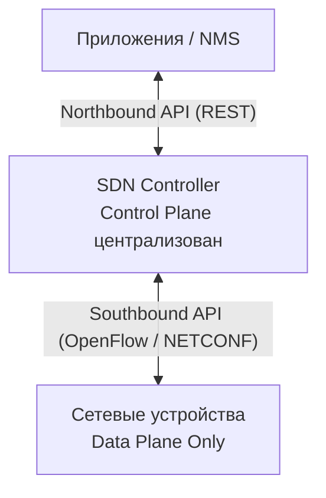

## Традиционные сети vs SDN

| Аспект | Традиционные сети | SDN |
|---|---|---|
| Управление | CLI на каждом устройстве | Централизованный контроллер |
| Конфигурация | Вручную, поочерёдно | Через API, политики |
| Гибкость | Низкая | Высокая |
| Видимость | Ограниченная | Сквозная (end-to-end) |
| Ошибки | Частые (ручной ввод) | Снижены автоматизацией |

---

## Плоскости сетевого устройства

| Плоскость | Название | Описание |
|---|---|---|
| Data Plane | Плоскость данных | Пересылка пакетов (FIB/CAM/TCAM) |
| Control Plane | Плоскость управления | Вычисление маршрутов (OSPF, STP, ARP) |
| Management Plane | Плоскость управления | SSH, SNMP, NetConf — конфигурация устройств |

### В SDN:
- **Control Plane** выносится на **централизованный контроллер**
- Устройства (data plane) получают правила пересылки от контроллера через протоколы (OpenFlow, NETCONF/YANG)

### Northbound и Southbound API

| API | Направление | Назначение | Протоколы |
|---|---|---|---|
| Northbound | Контроллер ↔ Приложения/NMS | Управление контроллером через приложения | REST, RESTCONF |
| Southbound | Контроллер ↔ Устройства | Программирование устройств | OpenFlow, NETCONF, YANG |

---

## Архитектуры SDN

| Тип | Описание |
|---|---|
| Pure SDN | Полностью centralized control plane (OpenFlow) |
| Hybrid SDN | Часть control plane на контроллере, часть — на устройствах |
| SD-WAN | SDN для WAN (Cisco Viptela/SD-WAN) |
| Cisco ACI | Application Centric Infrastructure для ЦОД |

---

## Cisco DNA Center

**Cisco DNA Center (Catalyst Center)** — платформа автоматизации и управления сетями.

### Возможности DNA Center

| Функция | Описание |
|---|---|
| Intent-Based Networking | Задаёшь намерение ("разрешить VLAN 10 на всех коммутаторах"), контроллер применяет |
| Network Discovery | Автоматическое обнаружение устройств |
| Network Design | Иерархия: Global → Site → Building → Floor |
| Provision | Автоматическая настройка устройств |
| Policy | Группы безопасности (SGT), сегментация |
| Assurance | Мониторинг, аналитика, устранение проблем |

### Взаимодействие с устройствами

### SD-Access

**SD-Access (Software-Defined Access)** — решение Cisco для автоматизации кампусных сетей:
- **Fabric** — оверлейная сеть поверх физической (VXLAN + LISP)
- **Control Plane** — LISP для отслеживания устройств
- **Data Plane** — VXLAN для туннелирования
- **Policy Plane** — TrustSec/SGT для микросегментации

---

## Протоколы конфигурации

### NETCONF (RFC 6241)

- Транспорт: SSH (TCP 830)
- Формат данных: XML
- Операции: get, get-config, edit-config, copy-config

### RESTCONF (RFC 8040)

- Транспорт: HTTPS
- Формат данных: JSON или XML
- Методы: GET, POST, PUT, PATCH, DELETE
- Основан на YANG модели данных

### YANG

**YANG** (Yet Another Next Generation) — язык моделирования данных для конфигурации сетевых устройств. Определяет структуру и типы данных, используемых в NETCONF/RESTCONF.

---

## Ресурсы

| Ресурс | Описание |
|---|---|
| [Cisco DNA Center Documentation](https://developer.cisco.com/docs/dna-center/) | Официальная документация DNA Center: API, Intent API |
| [SDN Overview — networklessons.com](https://networklessons.com/cisco/ccna-routing-switching-icnd2-200-105/software-defined-networking-sdn) | SDN: разделение control/data plane, OpenFlow, контроллеры |
| [Cisco SD-Access](https://www.cisco.com/c/en/us/solutions/enterprise-networks/software-defined-access/index.html) | SD-Access: fabric, underlay/overlay, policy, segmentation |
| [Jeremy's IT Lab — SDN and Automation (YouTube)](https://www.youtube.com/watch?v=UdmgpxTq6Yw) | SDN, DNA Center, управление и автоматизация из серии Free CCNA |
| [Cisco DevNet — DNA Center Sandbox](https://developer.cisco.com/site/sandbox/) | Бесплатная лаборатория для изучения DNA Center API |
| [OpenFlow — Open Networking Foundation](https://opennetworking.org/sdn-definition/) | Определение SDN и протокол OpenFlow от ONF |
