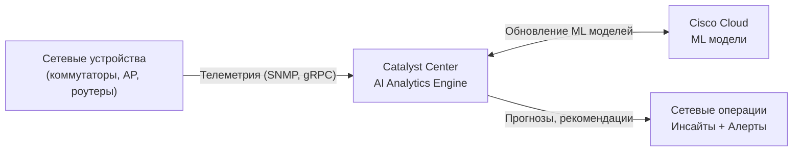

## Что такое ИИ и МО

**Искусственный интеллект (ИИ / AI)** — моделирование человеческого интеллекта компьютерами: обучение, рассуждение, принятие решений, самокоррекция.

**Машинное обучение (МО / ML)** — подмножество ИИ, где алгоритмы обучаются на данных без явного программирования. Система улучшается через распознавание паттернов.

```
AI ⊃ Machine Learning ⊃ Deep Learning
```

---

## Типы машинного обучения

| Тип | Принцип работы | Пример в сетях |
|---|---|---|
| **Supervised learning** | Обучается на размеченных данных (вход → ожидаемый выход) | Классификация спама, обнаружение вредоносного ПО |
| **Unsupervised learning** | Находит паттерны в неразмеченных данных | Обнаружение аномалий трафика, кластеризация |
| **Reinforcement learning** | Обучается методом проб и ошибок, оптимизирует награду | Адаптивная маршрутизация, балансировка нагрузки |
| **Deep learning** | Многослойные нейронные сети; обрабатывает сложные паттерны | Обнаружение вторжений, распознавание голоса |

> **💡 Совет:** На экзамене CCNA ключевое различие — **supervised** (размеченные данные, известный выход) vs **unsupervised** (без меток, находит паттерны самостоятельно). Deep learning — подмножество ML с нейронными сетями.

---

## Подобласти ИИ, важные для сетей

| Подобласть | Описание | Пример |
|---|---|---|
| **Predictive AI** | Анализирует исторические данные для прогнозирования | Предсказание перегрузки канала, планирование ёмкости |
| **Generative AI** | Генерирует новый контент (текст, конфиг, код) | ChatGPT, Cisco AI Assistant в Catalyst Center |
| **Natural Language Processing** | Понимает и генерирует человеческий язык | Чат-боты, голосовые запросы к сети |
| **Computer Vision** | Интерпретирует визуальную информацию | Камеры безопасности, мониторинг ЦОД |

---

## Применения МО в сетях

### Обнаружение аномалий

Самый распространённый сценарий применения ML в сетях. Система изучает **базовое поведение** (нормальные паттерны трафика, загрузку CPU) и сигнализирует об отклонениях.

| Базовая метрика | Пример аномалии |
|---|---|
| Объём трафика на интерфейсе | Резкий скачок → возможный DDoS |
| Распределение протоколов | Неожиданный ICMP flood |
| Время входа пользователя | Доступ в 3 ночи с нового местоположения |

### Классификация трафика

**Supervised learning** классифицирует трафик как нормальный или вредоносный на основе размеченных обучающих данных.

| ML задача | Входные данные | Выход |
|---|---|---|
| Classification | Заголовки пакетов, статистика потоков | Нормальный / Подозрительный / Вредоносный |
| Regression | Исторические данные трафика | Прогнозируемая пропускная способность на следующий час |

### Предиктивное обслуживание и планирование ёмкости

| Прогноз | Польза |
|---|---|
| Тренд загрузки канала | Обновление до перегрузки |
| Вероятность отказа устройства | Проактивная замена оборудования |
| Прогноз роста задержки | Перераспределение трафика заранее |

### Балансировка нагрузки

Reinforcement learning автоматически перераспределяет трафик по путям для оптимизации производительности — без ручного вмешательства, адаптируясь в реальном времени.

---

## Традиционное vs ИИ-управление сетью

| Аспект | Традиционное | ИИ-управление |
|---|---|---|
| Обнаружение сбоев | Пороговые алерты (статичные) | Базовое поведение + обнаружение аномалий |
| Анализ первопричины | Ручное расследование | Автоматическая корреляция симптомов |
| Планирование ёмкости | Периодический ручной обзор | Непрерывное предиктивное прогнозирование |
| Безопасность | Сигнатурный анализ известных угроз | Обнаружение неизвестных угроз по поведению |
| Конфигурация | CLI / скрипты | Intent-based + рекомендации ИИ |

---

## Cisco Catalyst Center AI Analytics

Cisco Catalyst Center (ранее DNA Center) включает **AI Network Analytics** — облачный ML-движок.

| Функция | Описание |
|---|---|
| **Базовое обучение** | Изучает нормальное поведение каждого устройства, SSID, клиента |
| **Обнаружение аномалий** | Сигнализирует при отклонении метрик от базовой линии |
| **Корреляция проблем** | Группирует связанные симптомы в единую первопричину |
| **AI-driven assurance** | Предсказывает проблемы до того, как пользователи их почувствуют |
| **Сравнительная аналитика** | Сравнивает вашу сеть с похожими сетями (peer benchmarking) |



---

## Нейронные сети — основы

**Нейронная сеть** — модель, вдохновлённая человеческим мозгом:

| Компонент | Описание |
|---|---|
| Нейрон | Обрабатывает вход, применяет вес, передаёт выход |
| Слой | Группа нейронов (вход → скрытые → выход) |
| Вес | Сила связи между нейронами |
| Обучение | Корректировка весов для минимизации ошибки |

**Deep learning** использует сети со многими скрытыми слоями — эффективно для сложных паттернов.

---

## Large Language Models (LLM)

**LLM** (ChatGPT, Gemini, Claude) — генеративные модели ИИ, обученные на огромных текстовых датасетах. В контексте сетей:

- Генерация конфигурационных шаблонов на естественном языке
- Ответы на вопросы по устранению неисправностей
- Суммаризация логов и алертов
- Cisco AI Assistant в Catalyst Center использует LLM для запросов на естественном языке

> **📌 Важно:** На экзамене CCNA не требуется глубокое знание LLM — нужно знать что это и высокоуровневые сценарии применения в управлении сетью.

---

## Ключевые концепции для экзамена

| Концепция | Что нужно знать |
|---|---|
| AI vs ML | AI — широкая область; ML — подмножество, обучающееся на данных |
| Supervised learning | Размеченные данные, задачи классификации и регрессии |
| Unsupervised learning | Без меток, находит паттерны — используется для обнаружения аномалий |
| Обнаружение аномалий | Изучает базовое поведение, сигнализирует об отклонениях — ключевой сценарий в безопасности |
| Predictive analytics | Прогнозирует будущие состояния (пропускная способность, отказы) |
| Generative AI | Создаёт новый контент; LLM как пример |
| Catalyst Center AI | AI-driven assurance, базовое обучение, корреляция проблем |

> **💡 Совет:** На CCNA экзамене фокус на **что** ИИ/МО делает в сетях, а не **как** работают алгоритмы математически. Ожидай вопросы о сценариях применения, типах обучения и инструментах вроде Catalyst Center AI Analytics.

---

## Ресурсы

| Ресурс | Описание |
|---|---|
| [AI and ML — networklessons.com](https://networklessons.com/cisco/ccna-200-301/artificial-intelligence-ai-and-machine-learning-ml) | ИИ/МО для CCNA: типы обучения, применения в сетях |
| [Cisco AI Network Analytics](https://www.cisco.com/c/en/us/products/analytics/ai-network-analytics/index.html) | AI-driven assurance: обнаружение аномалий, прогнозирование |
| [Cisco Catalyst Center AI Assistant](https://blogs.cisco.com/networking/catalyst-center-ai-assistant) | Запросы на естественном языке и ИИ-инсайты в Catalyst Center |
